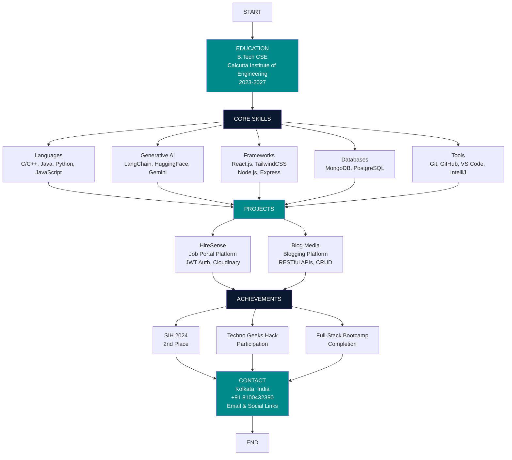

# Portfolio Website Development Plan

## Overview

Create a modern, animated portfolio website using React, Three.js, GSAP, and Tailwind CSS with automated GitHub/Vercel deployment, featuring a resume-based flowchart, responsive design, and smooth animations.

**Tech stack:** React, JavaScript (no TypeScript), Three.js, Tailwind CSS, GSAP  
**Colors:** White, Dark Cyan (#008B8B), Very Dark Blue (#0A192F)  
**Deployment:** Automated via GitHub + Vercel

---

## Task List

| # | Task | Status |
|---|------|--------|
| 1 | Initialize React project with Vite, install dependencies (React, Three.js, GSAP, Tailwind CSS), and configure JavaScript | Pending |
| 2 | Set up Tailwind CSS with custom color palette (white, dark cyan #008B8B, very dark blue #0A192F) | Pending |
| 3 | Build core layout components: Navbar, Footer, and main App structure | Pending |
| 4 | Create Hero section with enlarged profile picture, Three.js particle background, and GSAP animations | Pending |
| 5 | Build interactive Resume Flowchart component using React Flow or custom SVG with GSAP animations | Pending |
| 6 | Implement About, Experience, Projects, Skills, Contact, and Schedule Meets sections | Pending |
| 7 | Add Three.js particle system, minimal 3D model, and geometric elements throughout the site | Pending |
| 8 | Implement GSAP scroll-triggered animations, transitions, and micro-interactions | Pending |
| 9 | Make all components mobile responsive with breakpoints and touch-friendly interactions | Pending |
| 10 | Configure Vercel deployment with vercel.json and connect GitHub repository | Pending |
| 11 | Set up GitHub Actions workflow for automated deployment to Vercel | Pending |

---

## Project Structure

The portfolio will be built as a React application with the following structure:

```
Portfolio/
├── public/
│   ├── profile-picture.jpg (your profile image)
│   └── favicon.ico
├── src/
│   ├── components/
│   │   ├── Hero.jsx
│   │   ├── About.jsx
│   │   ├── Experience.jsx
│   │   ├── Projects.jsx
│   │   ├── Skills.jsx
│   │   ├── Contact.jsx
│   │   ├── ScheduleMeets.jsx
│   │   ├── ResumeFlowchart.jsx (interactive flowchart component)
│   │   ├── ThreeScene.jsx (Three.js wrapper)
│   │   ├── ParticleBackground.jsx
│   │   ├── Navbar.jsx
│   │   └── Footer.jsx
│   ├── hooks/
│   │   ├── useScrollAnimation.js
│   │   └── useThreeScene.js
│   ├── utils/
│   │   └── resumeData.js (resume data structure)
│   ├── styles/
│   │   └── globals.css
│   ├── App.jsx
│   └── main.jsx
├── package.json
├── tailwind.config.js
├── vite.config.js
├── vercel.json
└── .github/workflows/deploy.yml
```

---

## Color Scheme Implementation

Using Tailwind CSS custom colors:

- **White**: `#FFFFFF` (base background/text)
- **Dark Cyan**: `#008B8B` or `#20B2AA` (accent color)
- **Very Dark Blue**: `#0A192F` or `#112240` (primary dark background)

These will be configured in `tailwind.config.js` as custom theme colors.

---

## Key Features

### 1. Resume Flowchart Component

- Interactive flowchart visualization of career journey
- Created using React Flow or custom SVG with GSAP animations
- Nodes representing: Education → Skills → Projects → Achievements → Contact
- Smooth transitions between nodes
- Clickable nodes with detailed information

### 2. Three.js Integration

- **Particle Background**: Animated particle system in hero section
- **3D Model**: Subtle 3D element (geometric shape or abstract model)
- **Minimal 3D**: Lightweight geometric elements throughout

### 3. GSAP Animations

- Scroll-triggered animations for sections
- Fade-in animations for content
- Smooth page transitions
- Parallax effects
- Timeline animations for complex sequences

### 4. Responsive Design

- Mobile-first approach
- Breakpoints: sm (640px), md (768px), lg (1024px), xl (1280px)
- Hamburger menu for mobile navigation
- Responsive grid layouts
- Touch-friendly interactions

### 5. Profile Picture

- Large, prominent display in Hero section
- Circular or rounded design with border
- Hover effects with GSAP
- Responsive sizing (larger on desktop, appropriately sized on mobile)

---

## Implementation Phases

### Phase 1: Project Setup

1. Initialize React project with Vite
2. Install dependencies: React, Three.js, GSAP, Tailwind CSS, React Router
3. Configure Tailwind CSS with custom color palette
4. Set up JavaScript configuration (ESLint if needed)
5. Create folder structure

### Phase 2: Core Components

1. **Navbar**: Sticky navigation with smooth scroll
2. **Hero Section**: Large profile picture, name and title, particle background, CTA buttons
3. **About Section**: Personal introduction
4. **Experience Section**: Timeline of work experience
5. **Projects Section**: Portfolio grid with project cards
6. **Skills Section**: Technology badges/icons
7. **Resume Flowchart**: Interactive career visualization
8. **Schedule Meets**: Integration with calendar/meeting scheduler
9. **Contact Section**: Contact form and social links
10. **Footer**: Links and copyright

### Phase 3: Animations & Effects

1. Implement GSAP scroll triggers
2. Add Three.js particle system
3. Create 3D model/scene (minimal)
4. Add smooth transitions between sections
5. Implement hover effects and micro-interactions

### Phase 4: Responsive Design

1. Mobile navigation menu
2. Responsive grid layouts
3. Touch gesture support
4. Mobile-optimized animations
5. Profile picture responsive sizing

### Phase 5: Deployment Setup

1. **GitHub Actions**: Create workflow for automated builds
2. **Vercel Configuration**: Set up `vercel.json`
3. Connect GitHub repo to Vercel
4. Configure environment variables if needed
5. Test deployment pipeline

---

## Technical Details

### Dependencies

```json
{
  "react": "^18.x",
  "react-dom": "^18.x",
  "three": "^0.160.x",
  "@react-three/fiber": "^8.x",
  "@react-three/drei": "^9.x",
  "gsap": "^3.12.x",
  "tailwindcss": "^3.x",
  "react-router-dom": "^6.x"
}
```

Optional: `framer-motion` for additional animations.

### Tailwind Config

Custom color palette:

```js
colors: {
  'dark-cyan': '#008B8B',
  'very-dark-blue': '#0A192F',
  'white': '#FFFFFF'
}
```

### Vercel Configuration

- Automatic deployments on push to main branch
- Preview deployments for pull requests
- Environment variable management

### GitHub Actions

- Build verification
- Deployment triggers (Vercel handles deploy on push when connected)

---

## Resume Integration & Flowchart Structure

Based on **Abdullah Ahmed's** resume, the flowchart visualizes the career journey.

### Flowchart Visual Structure (Mermaid)



### Flowchart Nodes (Text)

```
START
  ↓
EDUCATION (B.Tech CSE, Calcutta Institute of Engineering and Management, 2023-2027)
  ↓
CORE SKILLS
  ├── Languages (C/C++, Java, Python, JavaScript)
  ├── Generative AI (LangChain, HuggingFace, Gemini)
  ├── Frameworks (React.js, TailwindCSS, Node.js, Express)
  ├── Databases (MongoDB, PostgreSQL)
  └── Tools (Git, GitHub, VS Code, IntelliJ IDEA)
  ↓
PROJECTS
  ├── HireSense (Job Portal Platform)
  │   └── Features: JWT Auth, Role-based Access, Cloudinary Integration
  └── Blog Media (Blogging Platform)
      └── Features: RESTful APIs, CRUD Operations, Cloudinary Integration
  ↓
ACHIEVEMENTS
  ├── SIH 2024 - 2nd Place
  ├── Techno Geeks Hack 1.0 Participation
  └── Full-Stack Bootcamp Completion
  ↓
CONTACT & SOCIAL LINKS
```

### Resume Data Structure (resumeData.js)

```javascript
export const resumeData = {
  personal: {
    name: "ABDULLAH AHMED",
    location: "Kolkata, West Bengal, India",
    phone: "+91 8100432390",
    email: "abdullah.ahmed.pisces1010@gmail.com",
    social: {
      github: "https://github.com/[username]",
      linkedin: "https://linkedin.com/in/[username]",
      instagram: "https://instagram.com/[username]"
    }
  },
  summary: "Detail-oriented Backend Developer with hands-on experience in building RESTful APIs, handling server-side applications using Node.js and Express. Strong understanding of databases, authentication, middleware, cloud integration, and application architecture. Passion for writing clean, scalable code and contributing to reliable backend systems.",
  skills: {
    languages: ["C/C++", "Java", "Python", "JavaScript"],
    generativeAI: ["LangChain", "HuggingFace", "Gemini"],
    frameworks: ["React.js", "TailwindCSS", "Node.js", "Express"],
    databases: ["MongoDB", "PostgreSQL"],
    tools: ["Git", "Github", "Visual Studio Code", "IntelliJ IDEA"]
  },
  projects: [
    {
      name: "HireSense - Modern Job Portal Platform",
      description: "Full-stack job portal for job seekers and recruiters with clean UI, scalable backend. Recruiters post/manage jobs; candidates build profiles, upload resumes, and apply.",
      tech: ["React", "shadcn/ui", "Node.js", "Express", "MongoDB", "JWT", "Cloudinary", "multer"],
      github: "[github-link]"
    },
    {
      name: "Blog Media - Blogging Platform",
      description: "Blogging platform with Node.js, Express, MongoDB. Secure RESTful APIs for user and content management (CRUD for blog posts), Cloudinary for media.",
      tech: ["Node.js", "Express", "MongoDB", "Cloudinary", "JWT"],
      github: "[github-link]"
    }
  ],
  education: {
    degree: "Bachelor of Technology in Computer Science and Engineering",
    institution: "Calcutta Institute of Engineering and Management | MAKAUT",
    period: "August 2023 - July 2027",
    percentage: "71.6%"
  },
  achievements: [
    "2nd Place in Internal Smart India Hackathon (SIH) 2024 for innovative problem-solving and team collaboration.",
    "Participated in Techno Geeks Hack 1.0 Hackathon, gaining hands-on experience in rapid prototyping and real-world problem statements.",
    "Completed The Complete Full-Stack Web Development Bootcamp by Angela Yu (Udemy), covering frontend, backend, databases, and deployment fundamentals."
  ]
}
```

### Flowchart Implementation Notes

- **Visual Flow**: Education → Skills → Projects → Achievements → Contact
- **Interactive Nodes**: Each node expands on hover/click to show details
- **GSAP Animations**: Nodes animate in sequence, connections draw smoothly
- **Color Coding**: Education & Projects & Contact = Dark Cyan; Skills & Achievements = Very Dark Blue
- **Responsive**: Flowchart adapts to mobile (vertical layout) and desktop (horizontal/flow layout)

---

## Portfolio Sections Content

### Hero Section

- Name: ABDULLAH AHMED
- Title: Backend Developer
- Location: Kolkata, West Bengal, India
- Large profile picture (enlarged as requested)
- Social links: GitHub, LinkedIn, Instagram

### About Section

- Use summary from resume
- Highlight backend development expertise
- Mention passion for clean, scalable code

### Skills Section

- Display all skill categories with icons/badges
- Interactive hover effects
- Organized by category (Languages, Frameworks, Databases, Tools, Generative AI)

### Projects Section

- **HireSense**: Job Portal Platform card (tech stack, features, GitHub link)
- **Blog Media**: Blogging Platform card (tech stack, features, GitHub link)

### Experience Section

- Highlight hackathon participation and achievements
- Timeline format showing growth journey

### Achievements Section

- SIH 2024 2nd Place (prominent)
- Techno Geeks Hack 1.0 participation
- Full-Stack Bootcamp completion

### Contact Section

- Contact form
- Direct contact info (phone, email)
- Social media links
- Location display

### Schedule Meets Section

- Calendar integration or meeting scheduler
- Time zone: IST (India Standard Time)

---

*Last updated: February 2026*
